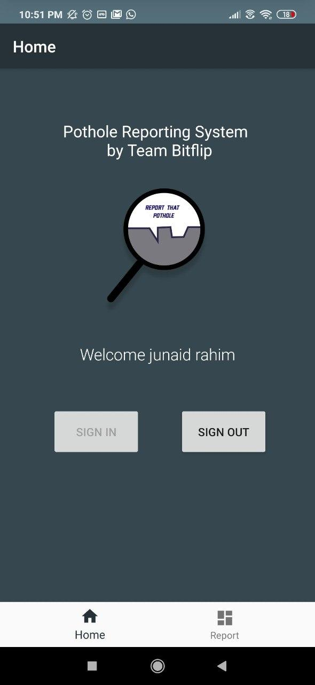

# Plothole - Android App

The mobile component of Plothole consists of an Android app the citizens can use to click photos of the potholes they spot. This repository has the
code for the android app.

The photo clicked by the user is saved in storage and then written to Firebase Storage. After a successful write to firebase storage, the image id is then sent
to the Plothole backend for further inference.

## Dependencies

The app is written in Kotlin. The `PlotholeApp` directory can be opened up as a regular Android Studio project

* [Firebase UI](https://firebase.google.com/docs/android/setup)
* [Firebase Auth](https://firebase.google.com/docs/auth), [Storage](https://firebase.google.com/docs/storage) and [Database](https://firebase.google.com/docs/database)
* [OkHTTP](https://square.github.io/okhttp/)

## Screenshots

## LICENSE
Copyright (c) **Team BitFlip**. All rights reserved. Licensed under the MIT License

